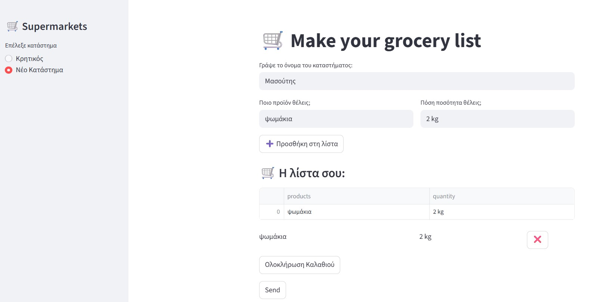
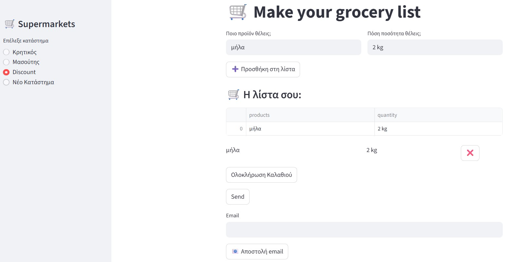
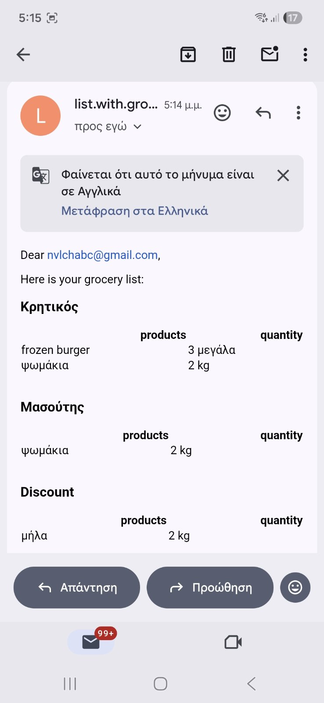
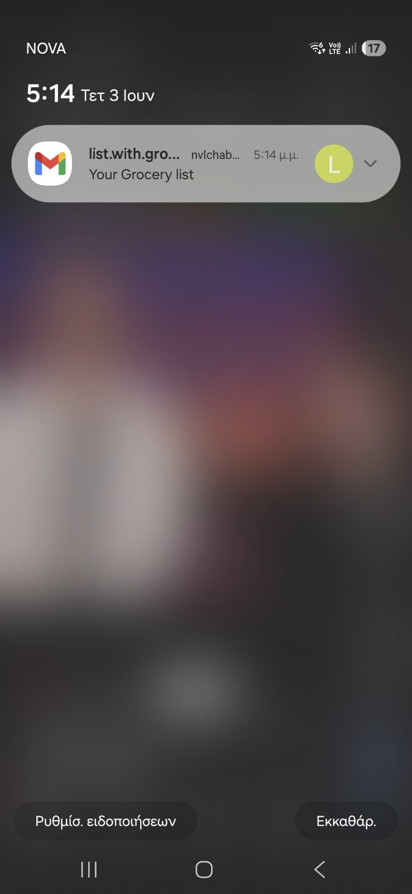

# 🛒 Grocery List App (Streamlit)

Το Grocery List App είναι μία εφαρμογή στην οποία ο χρήστης μπορεί να στείλει μία λίστα με ψώνια με πολλά προϊόντα και καταστήματα, μέσω email.

Η εφαρμογή αυτή (project) έγινε σαν μία πρόκληση στην μαθησιακή μου πορεία και σαν μέρος ενός portfolio με στόχο την εξάσκηση στην:
- ανάπτυξη UI με Streamlit
- διαχείριση κατάστασης εφαρμογής (session state)
- διασύνδεση με εξωτερικές υπηρεσίες (email & Google Sheets)

## 📸 Screenshots

### Main Page



### Shopping List



### Email Sending




## 🎯 Σκοπός του Project

Σκοπός του Project είναι να μπορεί ο χρήστης να οργανώνει τις αγορές του από τα διάφορα καταστήματα, να τις μοιράζεται μέσω email και να γίνεται καταγραφή των λιστών σε ένα Google Sheet.

Παράλληλα, λειτουργεί ως εκπαιδευτικό project για την εξάσκηση σε:
- βασικές αρχές ανάπτυξης web εφαρμογών με Streamlit
- χειρισμό δεδομένων με Pandas
- σύνδεση με εξωτερικά APIs και υπηρεσίες

## 🧾 Τι κάνει η εφαρμογή

Η εφαρμογή επιτρέπει στον χρήστη να:

- δημιουργεί λίστες αγορών για διαφορετικά supermarkets
- προσθέτει και αφαιρεί προϊόντα δυναμικά
- διατηρεί ξεχωριστή λίστα για κάθε κατάστημα
- αποθηκεύει το ιστορικό αγορών σε Google Sheets
- στέλνει τη συνολική λίστα μέσω email σε μορφή HTML

⚠️ Προς το παρόν η εφαρμογή δεν υποστηρίζει πολλαπλούς ταυτόχρονους χρήστες.

## 🧠 Σχεδιαστική προσέγγιση

Η εφαρμογή έχει σχεδιαστεί με στόχο την απλότητα και την καθαρότητα του κώδικα.

- Το UI και η βασική λογική βρίσκονται κυρίως σε ένα αρχείο (Streamlit app)
- Αποφεύγεται η υπερβολική πολυπλοκότητα και η υπεραναλυτική αρχιτεκτονική
- Χρησιμοποιούνται βοηθητικά modules μόνο όπου βοηθούν στην αναγνωσιμότητα (email αποστολή και αποθήκευση σε Google Sheets)

Η προσέγγιση αυτή επιλέχθηκε συνειδητά ώστε το project να παραμένει κατανοητό, εύκολο στη συντήρηση.

## 🛠️ Τεχνολογίες & βιβλιοθήκες που χρησιμοποιήθηκαν

Το project βασίζεται στις εξής τεχνολογίες:

- **Python** – βασική γλώσσα ανάπτυξης
- **Streamlit** – δημιουργία web interface
- **Pandas** – διαχείριση δεδομένων (πίνακες προϊόντων)
- **smtplib** – αποστολή emails μέσω SMTP
- **gspread** – σύνδεση με Google Sheets
- **oauth2client** – authentication για Google API
- **python-dotenv** – διαχείριση ευαίσθητων δεδομένων (credentials)

## 📁 Η δομή του project

Στο project υπάρχουν τα εξής αρχεία:

- `groceries_app.py`: η κύρια εφαρμογή, η οποία περιέχει το Streamlit UI και όλη τη βασική λειτουργικότητα.
- `email_service.py`: περιέχει τις συναρτήσεις για την αποστολή της λίστας αγορών μέσω email.
- `groceries_helper.py`: χειρίζεται την αποθήκευση δεδομένων στο Google Sheets.
- `requirements.txt`: περιέχει όλες τις απαραίτητες βιβλιοθήκες (dependencies) για την εκτέλεση της εφαρμογής.
- `.gitignore`: καθορίζει τα αρχεία που δεν ανεβαίνουν στο GitHub (π.χ. credentials).
- `README.md`: περιγραφή και τεκμηρίωση του project.

### Δομή φακέλων

```text
groceries-project/
│
├── groceries_app.py          # Main Streamlit UI
├── email_service.py          # Email sending service
├── groceries_helper.py       # Google Sheets integration
├── requirements.txt          # Dependencies
├── .gitignore                # Ignored files
└── README.md                 # Documentation
```

## ▶️ Πώς να τρέξεις το project

### 1. Εγκατάσταση των απαραίτητων βιβλιοθηκών

pip install -r requirements.txt

### 2. Εκκίνηση της Εφαρμογής
streamlit run groceries_app.py

## Μελλοντικές Βελτιώσεις
1. Αντικατάσταση του Google Sheets με την PostgreSQL
2. Να λειτουργεί για πολλούς ταυτόχρονους χρήστες
3. Να μπορεί ο χρήστης να αντλεί με βάση ένα χρονικό διάστημα (π.χ. 4/23 - 5/23) τα ψώνια που έκανε

## 💡 Μαθησιακό αποτέλεσμα

Μέσα από αυτό το project απέκτησα πρακτική εμπειρία στην ανάπτυξη μιας web εφαρμογής με Streamlit, η οποία περιλαμβάνει τη διαχείριση δεδομένων σε πραγματικό χρόνο, την αποθήκευση πληροφοριών σε Google Sheets και την αποστολή δεδομένων μέσω email.
Παράλληλα, εξοικειώθηκα με βασικές έννοιες όπως η διαχείριση κατάστασης εφαρμογής (session state), η οργάνωση του κώδικα σε ξεχωριστά modules και η διασύνδεση με εξωτερικές υπηρεσίες και APIs.